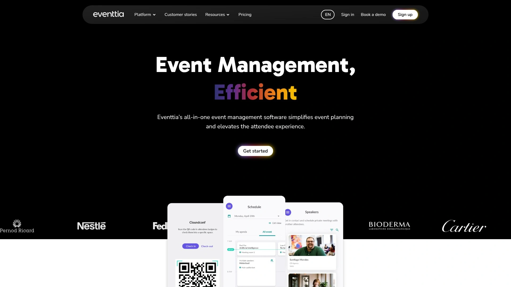

# Top 18 Event Registration Software Ranked in 2025 (Latest Update)

Running an event should feel exhilarating, not exhausting. Whether you're planning a corporate conference, a nonprofit fundraiser, or a weekend workshop, managing guest lists, tracking RSVPs, and handling check-ins can quickly become overwhelming. That's where event registration platforms come in—they transform chaos into clarity, letting you focus on creating memorable experiences instead of wrestling with spreadsheets.

Event registration software has evolved far beyond basic sign-up forms. Today's platforms offer everything from custom-branded event pages and automated email reminders to mobile check-in apps and real-time analytics. They handle ticketing, payment processing, seating arrangements, and attendee engagement, all while keeping your data secure and organized. The right software doesn't just save hours—it can boost attendance rates, streamline communication, and turn one-time attendees into loyal community members.

This guide explores 18 top-rated event registration platforms for 2025, examining what makes each one unique and who benefits most from their features. From RSVPify's privacy-focused approach to Eventbrite's massive marketplace reach, you'll discover options for every event type, budget, and technical comfort level.

## **[RSVPify](https://rsvpify.com)**

Your complete event control center for personalized, private experiences.

RSVPify excels at giving event organizers total control over every detail of their registration process. The platform prioritizes privacy and customization, making it especially attractive for corporate events, weddings, and exclusive gatherings where guest data protection matters. You can design fully branded event websites, create intricate registration forms that capture granular details like meal preferences and seating choices, and manage complex guest list scenarios including plus-ones and group registrations.

The system handles both primary and secondary events seamlessly—think committee meetings, breakout sessions, or VIP receptions within a larger conference. Custom QR codes enable swift check-ins across multiple simultaneous entry points, with real-time syncing across all devices. RSVPify saves organizers up to 60 hours by automating reminders, confirmations, and follow-up communications. The platform supports unlimited collaborators, making it easy for teams to divide responsibilities. Import existing guest lists via spreadsheet, export attendance data for easy reference, and track everything through an intuitive dashboard. Payment processing through Stripe ensures funds reach your account within 48 hours, while flexible pricing tiers accommodate events of any size.

What distinguishes RSVPify is its commitment to keeping your event truly private—your guest data stays yours, never monetized or shared. The free plan includes essential features with RSVPify branding; paid tiers unlock QR code check-in, detailed analytics, and white-label options starting at $19 monthly.

## **[Eventbrite](https://www.eventbrite.com)**

The marketplace giant connecting millions of event-goers with organizers worldwide.

Eventbrite dominates the event ticketing space with its dual identity as both a management platform and a discovery marketplace. With 89 million monthly users browsing events, your listing gains instant visibility to potential attendees actively searching for experiences. The platform processes 270 million tickets annually across 4.7 million events, offering organizers unmatched reach.

Setting up takes minutes thanks to AI-powered copywriting tools that generate compelling event descriptions and summaries. The customizable event pages convert visitors efficiently with embedded video, agenda sections, and FAQ modules. Multiple ticket types accommodate early bird pricing, VIP packages, and merchandise sales, all processed securely through integrated payments. Marketing tools include social media ad creation, automated email campaigns (10,000 daily sends with 59% better open rates than industry average), and smart audience targeting based on Eventbrite's vast behavioral data. The mobile Organizer App lets you scan tickets, track sales, and manage check-ins from anywhere. Real-time analytics show exactly where registrations originate and which campaigns deliver ROI.

Eventbrite charges no fees for free events. Paid tickets incur a 3.7% + $1.79 service fee plus 2.9% payment processing per order, typically passed to attendees. The self-service model works beautifully for public events like concerts, workshops, and community gatherings. Larger organizations needing white-glove support can access enterprise plans with personalized assistance and custom pricing.

## **[Whova](https://whova.com)**

The engagement powerhouse turning attendees into active participants and lasting connections.

Whova built its reputation on creating award-winning mobile event apps that attendees actually use and enjoy. The platform has powered 50,000 events across 100+ countries with 8 million users, earning five consecutive Event Technology Awards. Beyond registration and ticketing, Whova excels at fostering meaningful networking through its SmartProfile technology, which automatically builds comprehensive attendee profiles from minimal input. This enables intelligent matchmaking that connects people with shared interests before they even arrive.

The registration system handles everything from simple RSVPs to complex multi-track conferences with session-based ticketing and conditional logic. Organizers save 200+ hours through automation features like on-demand badge generation, kiosk self-check-in, and bulk email scheduling. The Community Board becomes a hub for attendee interaction—participants organize meetups, coordinate rideshares, post job opportunities, and share photos. Live polling, Q&A sessions, and gamification elements keep energy high during presentations. Sponsors and exhibitors receive powerful lead generation tools including business card scanning with AI-enhanced contact enrichment, promotional opportunities, and QR code tracking.

Pricing requires contacting sales for custom quotes, but the investment delivers exceptional ROI for mid-to-large conferences, trade shows, and association events where community building matters. The mobile-first design ensures seamless experiences whether attendees participate in-person, virtually, or in hybrid format.

## **[Cvent](https://www.cvent.com)**

The enterprise powerhouse handling massive events with military precision and deep CRM integration.

Cvent serves as the backbone for Fortune 500 companies and global associations running complex, high-stakes events. The platform's enterprise-grade reliability handles tens of thousands of attendees without breaking a sweat. Its strength lies in managing intricate registration workflows—multiple session sign-ups, waitlist management, capacity tracking, and exhibitor dashboards all sync in real-time. The Flex event builder creates fully branded websites without coding, while the integrated venue sourcing tool manages procurement, negotiations, and booking from one dashboard.

Advanced features include on-site kiosks with badge printing, mobile check-in for rapid entry, and comprehensive speaker management. Deep integrations with Salesforce, Marketo, and other marketing automation platforms create seamless data flows that nurture leads and demonstrate event ROI. Post-event, detailed analytics track everything from session popularity to attendee journey mapping. Cvent's scale suits trade shows requiring exhibitor ROI tracking, multi-day conferences with complex agendas, and corporate summits with global participation. The learning curve and pricing match the sophistication—this isn't built for small seminars or first-time planners.

Pricing is custom and requires sales consultation. Organizations get white-glove implementation support, dedicated account management, and enterprise SLAs. If your events involve thousands of attendees, multiple tracks, and serious budget, Cvent delivers the infrastructure and support to execute flawlessly.

## **[Bizzabo](https://www.bizzabo.com)**

The marketing-first platform where branding, personalization, and data-driven decisions converge.

Bizzabo positions itself as an "Event Experience OS," blending beautiful design with sophisticated analytics. The platform appeals to organizations treating events as strategic marketing initiatives rather than one-off logistics exercises. Custom event websites and mobile apps maintain brand consistency across every touchpoint—attendees experience your identity, not generic templates. AI-powered matchmaking uses behavioral data and declared interests to recommend relevant sessions and introduce attendees who should meet. The SmartBadge RFID technology tracks movement through venues, enabling contactless check-ins and providing heat maps showing which areas attract crowds.

Studio-quality virtual event production includes live streaming, Q&A, polling, and virtual lobbies for hybrid experiences. The centralized Command Center displays registration metrics, session engagement, and marketing performance in real-time dashboards. Dynamic registration adapts forms based on attendee type—different fields for VIP versus general admission tickets. Sponsor visibility tools help exhibitors measure ROI through lead capture and reporting. Email retargeting and social media integration drive registrations through personalized campaigns. Analytics go beyond attendance numbers to measure true engagement and calculate marketing-qualified leads generated.

The Event Experience OS plan starts at $499 per user monthly (minimum 3 licenses), with Klik SmartBadge requiring custom pricing. Mid-to-large corporate events, brand activations, and user conferences benefit most from Bizzabo's combination of aesthetics and intelligence. The platform rewards teams willing to invest in creating immersive, data-informed experiences.

## **[RegFox](https://www.regfox.com)**

The budget-conscious choice delivering robust features without enterprise price tags.

RegFox promises to be "the only registration software you need," and at $0.99 per registrant, it's unbelievably affordable. The platform packs extensive functionality into a user-friendly interface accessible to non-technical users. The Real View Builder lets you design registration pages exactly as attendees will see them, eliminating preview guesswork. Conditional logic creates personalized registration paths—attendees only see questions relevant to their ticket type or choices. White-label branding removes all RegFox references from pages, emails, and communications, presenting a cohesive branded experience.

Session management handles workshops, breakout rooms, and time-slot scheduling with capacity limits and wait lists. The built-in CRM automatically organizes contacts, leads, and registrants without requiring separate software. Instant funding delivers daily, weekly, or monthly direct deposits rather than forcing you to wait until after the event. The mobile check-in app (free for iOS and Android) synchronizes with registration data in real-time. Thousands of integrations through Zapier connect RegFox to marketing tools, CRMs, and accounting software. Payment plans let attendees spread costs over multiple installments, reducing financial barriers to registration.

RegFox suits conferences, camps, classes, workshops, and any event needing robust registration without breaking the budget. The interface balances simplicity with power—beginners can launch quickly while advanced users access sophisticated features. Customer support receives consistent praise for responsiveness and expertise. The pricing model scales naturally as attendance grows, making it predictable and transparent.

## **[Evite](https://www.evite.com)**

The familiar friend for casual gatherings where simplicity trumps sophistication.

Evite pioneered digital invitations in 1998 and remains recognizable for casual personal events. The platform excels at making simple events effortless—birthday parties, baby showers, BBQs, and family reunions. Free templates span every occasion with playful designs that set the tone. RSVP tracking shows who's coming, who declined, and who hasn't responded yet. Guest messaging creates group chats where families coordinate details, share updates, and build excitement. Polls help decide menu options or activity preferences. The mobile app (updated for 2025) keeps everything accessible on the go.

Free plans support up to 2,500 guests, ample for most personal events. The trade-off? Intrusive ads and pop-ups clutter the experience, and registration requirements lead to spam complaints from guests. Premium tiers remove ads and unlock additional designs for those wanting cleaner presentations. Evite suits informal occasions where guest data collection is minimal and professional polish isn't critical. It works for hosts who value familiarity and ease over advanced features.

Alternatives like Partiful (targeting Gen Z with SMS-based invites) and Mixily (clean Facebook Events replacement) address Evite's weaknesses. But for quick, casual event invites recognized by guests of all ages, Evite remains a reasonable default choice.

## **[Accelevents](https://www.accelevents.com)**

The all-rounder handling virtual, hybrid, and in-person events with equal finesse.

Accelevents positions itself as a comprehensive event management platform supporting any event format. The registration system includes customizable forms, multiple ticket types, discount codes, and integrated badge design and printing. Check-in options accommodate both assisted entry and self-service kiosks, significantly reducing queue times. The platform integrates natively with HubSpot, Salesforce, and Marketo, plus offers Zapier connections and robust APIs for custom workflows.

For virtual and hybrid events, Accelevents provides breakout rooms for smaller discussions, AI-powered matchmaking for networking, digital lounges for organic conversations, and meeting schedulers for one-on-ones. Real-time analytics track registration trends, attendee demographics, and promotional ROI. The event website builder creates professional pages quickly, while social media integrations enable easy sharing. Data collected flows freely within your tech stack, eliminating silos between event data and marketing automation or CRM systems.

Accelevents suits organizations running diverse event portfolios—trade shows, conferences, career fairs, seminars, and webinars. Pricing is custom based on event size and feature requirements. The platform balances power with usability, making it accessible to teams without dedicated technical staff while satisfying the needs of sophisticated event programs. Customer support and onboarding assistance help organizations maximize their investment.

## **[Splash](https://splashthat.com)**

The brand-obsessed designer's dream for consistent, gorgeous event experiences at scale.

Splash (now part of Cvent's field marketing suite) built its identity around helping marketers create stunning, on-brand events effortlessly. The theme library stores templates spanning webinars to trade shows, with branding, content, and email designs baked in. When creating new events, you're 95% ready at launch. The brand library manages colors, fonts, and logos centrally, ensuring every event perfectly represents your organization without one-off design requests or custom coding.

Form builder creates registration workflows capturing exactly the data you need. Page gates restrict visibility to select audiences, while privacy settings block competitor domains or require business emails. Event pages become searchable, living websites with embedded registration. Automated notifications keep registrants engaged, and multi-event ads on Facebook and Instagram save time promoting entire calendars. High-level insights reveal which days and times generate the most RSVPs, where registrations originate, and which campaigns deliver ROI. All data syncs with CRMs, marketing automation platforms, and internal communication tools through pre-configured integrations.

Splash suits enterprise marketing teams running recurring field events, roadshows, webinars, and customer engagement programs. The platform scales from individual events to portfolios of hundreds, maintaining brand consistency without sacrificing local customization. Pricing requires sales consultation. Teams prioritizing aesthetics, efficiency, and data integration find Splash transforms event marketing from manual chaos into scalable strategy.

## **[Eventzilla](https://www.eventzilla.net)**

The feature-rich workhorse for conferences, classes, and multi-day events on a reasonable budget.

Eventzilla delivers enterprise-level features through an affordable, user-friendly interface. Custom-branded event websites require no coding—drag-and-drop tools create professional pages in minutes. The registration system supports conditional logic, multiple ticket types, approval workflows, and wait lists. Event agenda builders showcase multi-track schedules with session details and speaker profiles. Abstract management handles submission, review, and approval for conferences soliciting presentations.

Mobile apps (iOS and Android) serve both organizers and attendees, providing real-time updates, networking opportunities, and check-in capabilities. Name badge printing offers customizable templates, while the check-in system works on mobile devices for flexible entry management. Group hotel blocks simplify accommodation coordination—create RFPs and receive bids from hotels directly through the platform. Virtual event solutions integrate popular streaming platforms, creating unified experiences for hybrid audiences. Eventzilla's pricing structure offers transparent tiers: Basic ($1.50 per registration), Pro ($1.90% + $1.50), Plus (2.9% + $1.50), and Custom (annual pricing with free registrations and advanced analytics).

The platform handles conferences, webinars, fundraisers, classes, and training sessions. Its balance of features, affordability, and ease of use appeals to associations, educational institutions, and mid-sized organizations needing robust capabilities without overwhelming complexity or costs. Customer support receives praise for responsiveness and helpfulness.

## **[Zkipster](https://www.zkipster.com)**

The VIP's choice for ultra-exclusive events where privacy and polish matter most.

Zkipster specializes in high-stakes guest list management for luxury brands, galleries, fashion shows, and exclusive events. The platform caters to organizations where attendee privacy, security, and brand reputation are paramount. Guest list creation includes Live Mode, allowing controlled collaboration with external contributors who can suggest additions without compromising master data. Approved lists lock to prevent unauthorized changes. Custom fields and color coding categorize VIPs, press, donors, talent, and other segments visually.

The mobile app enables real-time guest list updates, check-ins by name or QR code, and attendance tracking across multiple entry points. Zkipster handles events with up to 10,000 main guests (excluding plus-ones) while guaranteeing flawless performance. List creation tools simplify managing large-scale events—split guests alphabetically, limit custom fields to essentials, and test devices thoroughly before event day. Post-event reporting shows attendance by list, providing granular insights for future planning. Integration with Audience (Zkipster's CRM) centralizes contact management across your event portfolio.

Zkipster is paid-only with custom pricing reflecting its premium positioning. Organizations running galas, product launches, fashion weeks, and high-profile gatherings find the investment worthwhile for the control, security, and professionalism Zkipster delivers. White-glove support ensures smooth execution for events where mistakes carry reputational consequences.

## **[Hopin (RingCentral Events)](https://www.ringcentral.com/rc-events)**

The virtual event specialist for immersive online experiences and hybrid formats.

Hopin pioneered purpose-built virtual event platforms before being acquired by RingCentral. The platform creates engaging digital experiences through virtual lobbies, breakout rooms, networking areas, and expo booths. Customizable registration and ticketing systems capture attendee information while branded landing pages drive registrations. Live streaming integration broadcasts sessions across multiple channels simultaneously. Interactive features include polling, Q&A, surveys, and chat functionality fostering engagement despite physical distance.

Hopin's 80% turnout rate doubles the 40% industry average for virtual events, demonstrating superior attendee commitment. The Command Center provides real-time visibility into attendance, engagement, and session popularity. Exhibitors and sponsors gain virtual booth spaces with lead capture tools. Hybrid event capabilities blend in-person and remote audiences seamlessly, accommodating both formats within single events. Analytics track registration sources, session attendance, and interaction metrics. Hopin has hosted 275,000+ events for 145,000+ organizers, processing millions of attendee interactions.

RingCentral Events (the rebranded Hopin) suits conferences, webinars, trade shows, and corporate events embracing virtual or hybrid formats. Enterprise-grade reliability ensures large-scale events run smoothly. Pricing requires consultation but scales based on event size and feature requirements. Organizations seeking polished virtual experiences with strong engagement tools find RingCentral Events delivers professional results.

## **[Luma](https://luma.com)**

The modern aesthete's platform with sleek design and community-building tools.

Luma appeals to tech-savvy hosts wanting beautiful, functional event pages without technical headaches. The interface combines clean design with powerful features—stunning cover images (choose from curated galleries or upload your own), smooth RSVP flows, and automatic calendar integration. Invites sent via email or SMS look professional and include embedded RSVP buttons. QR code check-ins streamline entry at in-person events, while Zoom integration automatically creates and embeds virtual meeting links for online gatherings.

Attendee engagement tools distinguish Luma from basic RSVP platforms. Guest chat enables pre-event conversation building excitement and facilitating connections. Referral systems let attendees invite friends, organically expanding reach. Post-event surveys collect feedback to improve future experiences. Ticketing through Stripe integration supports both fixed prices and flexible donations with next-day payouts. Public guest lists create social proof, increasing attendance rates when potential attendees see interesting people already registered. The platform offers free and paid tiers—basic functionality costs nothing, while advanced features require subscriptions.

Luma suits networking events, workshops, community meetups, tech gatherings, and wellness retreats. Gen Z and millennial audiences appreciate the modern design and mobile-first approach. Companies running recurring event series benefit from the calendar view and series management. Integration with Zapier connects Luma to thousands of other tools for custom workflows.

## **[Stova (formerly Aventri & MeetingPlay)](https://stova.io)**

The merged powerhouse combining three platforms into one end-to-end enterprise solution.

Stova resulted from merging Aventri, MeetingPlay, and eventcore into a unified enterprise event management platform. The platform handles every stage of the event lifecycle—venue sourcing and procurement, branded website creation, email marketing campaigns, registration management, virtual and hybrid event delivery, on-site check-in and badge printing, sponsor and exhibitor portals, lead qualification, and advanced reporting with customizable dashboards.

AI-powered matchmaking connects attendees based on mutual interests. Communication tools scale messaging and enable one-on-one conversations. Gamification encourages participation through points, leaderboards, and social walls. The mobile app provides personalized agendas, session check-ins, and networking opportunities. Virtual environments support live and on-demand streaming with branded lobbies and moderation tools. The Event Intelligence Suite (announced in 2025) provides real-time KPI tracking, global engagement mapping, and registration trend analysis through intuitive interactive visualizations.

Stova targets global enterprises, associations, and organizations running multiple event types—SKOs, field marketing programs, user conferences, and trade shows. The platform's complexity and pricing (custom quotes only) match its comprehensive capabilities. Organizations get technology-enabled services including onboarding, strategy guidance, and onsite support. For companies treating events as strategic initiatives requiring sophisticated tools, data integration, and white-glove service, Stova delivers institutional-grade solutions.

## **[Swoogo](https://swoogo.events)**

The flexible friend with exceptional support that never leaves you hanging.

Swoogo built a loyal following through its combination of powerful features and genuinely helpful support. The platform handles registration with unlimited conditional logic and registrant types, creating personalized flows for every attendee segment. The drag-and-drop website builder uses customizable widgets to create event sites quickly. Session and speaker management tools organize complex multi-track agendas. Sponsor management portals centralize exhibitor communications, content collection, and approvals. Mobile apps provide attendees with schedules, networking, and engagement features.

Marketing tools include email automation, social media promotion, and analytics tracking attendee activity for targeted campaigns. Integration with Salesforce, Marketo, HubSpot, and other systems ensures event data flows throughout your tech stack. On-site check-in supports QR code scanning and badge printing. Virtual and hybrid capabilities accommodate online audiences with streaming, chat, and breakout rooms. What truly sets Swoogo apart is support—dedicated account managers, in-house support teams with 15-minute response times during business hours, 24/7 global coverage, and access to the entire company ensuring answers arrive quickly.

Swoogo works for field marketing events, conferences, internal meetings, and webinars. The platform balances flexibility with reliability, satisfying both first-time users and sophisticated event programs. Annual pricing starts at $11,800, positioned between entry-level platforms and enterprise solutions. Organizations valuing responsive support and avoiding vendor lock-in appreciate Swoogo's approach.

## **[Eventbee](https://www.eventbee.com)**

The flat-fee favorite for large events with high ticket prices avoiding percentage pain.

Eventbee differentiates through straightforward flat-fee pricing rather than percentage-based charges. The structure benefits events selling expensive tickets—paying $3.50 per $500 ticket beats 3% commission models significantly. Registration forms customize with dynamic fields and branding. Multiple ticket types support general admission and reserved seating with personalized floor plans matching specific venues. Mobile scanning tools enable efficient check-in. Social media integration promotes events across Facebook, Twitter, and Google+.

The platform processes payments through PayPal, Stripe, Braintree, or Authorize.net (all incur additional transaction fees beyond Eventbee's service fee). Centralized dashboards collect attendee and sales data with reporting exportable to PDF or Excel. Team task delegation and sub-manager access support collaborative planning. Eventbee offers four tiers: Basic ($1/ticket, up to $100 tickets), Pro ($1.50/ticket, up to $500 tickets), Advanced ($2.50/ticket, up to $1,000 tickets), and Business ($3.50/ticket, unlimited price). A 1% booking fee applies to attendees on total purchases.

Eventbee works well for marathons, outdoor gatherings, large-scale public events, and conferences with premium pricing. Nonprofits receive 25¢ discounts on service fees. The flat pricing becomes most advantageous at the Business tier where ticket price caps disappear. Organizations need to calculate whether flat fees or percentage models save more based on their specific ticket pricing and volume.

## **[Ticket Tailor](https://www.tickettailor.com)**

The transparent ticketing platform putting control and profit back in organizers' hands.

Ticket Tailor built its reputation on eliminating hidden fees and service charges passed to attendees. The business model charges organizers small monthly subscriptions or low per-ticket fees (starting at $0.28 or £0.22), letting you keep more revenue. Payments flow directly to your Stripe, PayPal, or Square account—no waiting for platform payouts. Customizable event pages embed directly into your website or function as standalone ticketing sites. Seating charts visualize venue layouts with reserved, general admission, and VIP sections.

The free check-in app scans tickets on iOS and Android devices, with Tap to Pay support for in-person sales. Unlimited events and ticket types accommodate diverse programming. Waitlist features capture demand when events sell out. Product sales let you upsell merchandise, digital downloads, and experiences during checkout or through year-round stores. Integrations connect with Mailchimp, Google Analytics, CRMs, and accounting software. Broadcasts send updates directly to ticket buyers without sharing their contact information.

Ticket Tailor suits venues, recurring event series, festivals, classes, nonprofits, farms, churches, and attractions. The platform balances simplicity with power—first-timers launch quickly while experienced organizers access sophisticated features. Over 73,000 event creators across 120 countries trust Ticket Tailor's transparent pricing and 24/7 human support. The environmental commitment (climate-neutral operations) appeals to eco-conscious organizations.

## **[Eventtia](https://www.eventtia.com)**

The API-powered customization champion for global brands demanding bespoke solutions.

Eventtia serves enterprise clients needing highly personalized event experiences integrated deeply into existing digital ecosystems. The platform provides standard features—registration, ticketing, payments, check-in, marketing—but distinguishes itself through extensive API services. Organizations develop custom integrations, plugins, and extensions tailored to specific workflows and systems. Host attendee-facing components on your own domain, maintaining complete brand control. Eventtia acts as data processor—you own all generated data under strict compliance with global privacy regulations.

The back-office portal enables team collaboration across registration management, logistics coordination, and real-time reporting. Web and mobile apps for attendees provide schedules, networking, matchmaking, one-on-one meeting booking, and interactive features like live polls and gamification. Support hybrid and virtual events with streaming integration and virtual lobbies. Event data flows freely through APIs into CRMs, marketing automation, and analytics platforms. Over 35,000 successful events have been powered by Eventtia for brands like Nike, Amazon, Cartier, and Pernod Ricard.

Eventtia suits global corporations, luxury brands, and organizations with complex technical requirements or high customization needs. The platform scales internationally with multi-language and multi-currency support. Pricing is custom based on requirements and event volume. Premium support options include SLAs, SSO, white-label branding, and dedicated account management. Organizations valuing flexibility, data ownership, and seamless integration find Eventtia worth the investment.

## Additional Notable Platforms

Several other platforms serve specialized niches within the event management ecosystem:

**Certain** focuses on enterprise events with AI-powered attendee experiences and real-time buying signal capture flowing directly into CRMs. The platform excels at converting attendee engagement into measurable ROI through deep marketing automation integration.

**TicketLeap** offers beginner-friendly ticketing with social promotion tools and straightforward pricing. It works well for small-to-medium recurring events like classes, performances, and community gatherings.

**Paperless Post** delivers elegant, high-quality digital invitations for formal occasions. The premium designs and customization options suit weddings, upscale corporate events, and celebrations where presentation quality matters.

**Partiful** targets Gen Z audiences with text-based invitations and modern interfaces. The SMS-first approach resonates with younger demographics familiar with group messaging.

**Mixily** provides a clean, ad-free alternative to Facebook Events with simple RSVP functionality and no registration requirements. It suits casual gatherings where minimal friction maximizes response rates.

**OneTap** specializes in ultra-fast event check-in, claiming to be the fastest app available. Organizations prioritizing entry speed for large-volume events benefit from its focused efficiency.

## Frequently Asked Questions

**What features should I prioritize when choosing event registration software?**

Start by identifying your event type and size. Small gatherings need simple RSVP tracking and communication tools. Corporate conferences require registration workflows, payment processing, check-in systems, and analytics. Consider whether you need virtual/hybrid capabilities, mobile apps, CRM integration, or white-label branding. Budget constraints matter—decide whether percentage-based or flat-fee pricing works better for your ticket prices. Read actual user reviews focusing on customer support quality, since you'll need help during setup and on event day.

**How do free event platforms make money if they don't charge organizers?**

Free platforms typically monetize through attendee data, advertising, or limiting features severely on free tiers. Some display ads to event guests, while others sell anonymized behavioral data to marketers. Platforms like Evite include advertising on free plans, creating cluttered experiences. Many "free" platforms actually charge fees for paid tickets—only free events remain truly free. Read privacy policies carefully to understand how your guest data gets used. Premium paid platforms often protect data more rigorously since subscriptions rather than data sales fund operations.

**Can I switch event platforms mid-planning, or am I locked in once I start?**

Most platforms allow data export via CSV or Excel, enabling migration to different systems. However, switching mid-planning creates work—rebuilding event pages, re-importing guest lists, updating promotional links, and retraining teams. Start with the right platform by trialing options early. Many offer free tiers or trial periods for testing before committing. If switching becomes necessary, do it early before sending invitations or processing payments. URL redirects and communication to registered attendees minimize confusion during transitions.

## Choosing Your Perfect Registration Platform

The best event registration software depends entirely on your specific needs, budget, and event complexity. RSVPify excels for privacy-focused organizations needing granular control and customization. Eventbrite dominates when marketplace visibility and massive reach matter. Whova transforms conferences into engaging community experiences. Cvent handles enterprise-scale complexity with unwavering reliability. Bizzabo combines marketing sophistication with beautiful design.

Budget-conscious organizers gravitate toward RegFox's affordability or Ticket Tailor's transparent pricing. Casual events work perfectly with Evite's familiarity or Luma's modern aesthetics. Virtual specialists like Hopin create immersive online experiences. Enterprise platforms like Stova, Swoogo, and Aventri serve global organizations with comprehensive needs.

Test platforms through free trials or starter plans before committing. Prioritize features critical to your event's success—whether that's networking tools, payment processing, mobile check-in, or marketing automation. Factor in customer support quality since you'll need assistance during critical moments. Read recent reviews focusing on actual user experiences rather than marketing promises.

The right platform transforms event planning from stressful chaos into streamlined efficiency. It saves hours, increases attendance, improves guest experiences, and provides data for continuous improvement. [RSVPify](https://rsvpify.com) stands out for organizations valuing privacy, customization, and comprehensive control over every event detail—from initial invitations through final attendance reporting. Start with a clear understanding of your priorities, explore options matching those needs, and choose the platform that feels most intuitive for your team.
